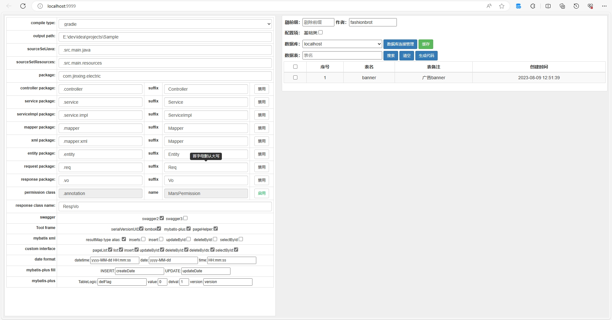

# mybatis-generate 
###  mybatis 代码生成工具、包含 entity、mapper、mapperXml、service、serviceImpl 、controller 等其他工具的代码生成。
###  其中包含 springboot、mybatis-plus 、lombok、pageHelper、swagger2、swagger3 框架集成
### 目前只支持mysql、oracle、SqlServer、postgresql 、sqlite，其他数据库，需要自行 实现Query,增加 QueryHelper 方可实现
### 添加自定义生成文件，可在vm.json 中添加即可
### 支持在线增加数据库连接，增加后即可生成对应的数据库代码

###  下载 mybatis-generate.exe 运行即可使用

# 如需要更多功能请 在这里提交 [issues](https://gitee.com/fashionbrot/mybatis-generate/issues)

# 版权 | License

[Apache License 2.0](https://www.apache.org/licenses/LICENSE-2.0)

# 捐赠 | Donate

> [捐赠记录,感谢你们的支持！](https://gitee.com/fashionbrot/mybatis-generate/wikis/%E6%8D%90%E8%B5%A0%E8%AE%B0%E5%BD%95)

